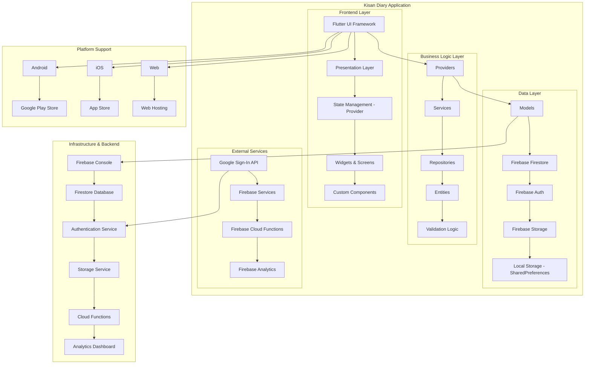
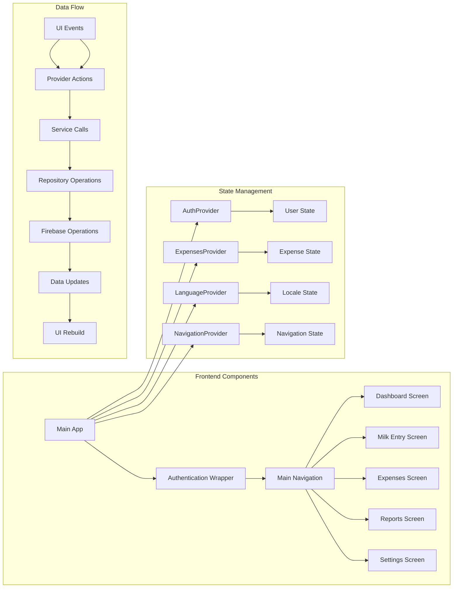
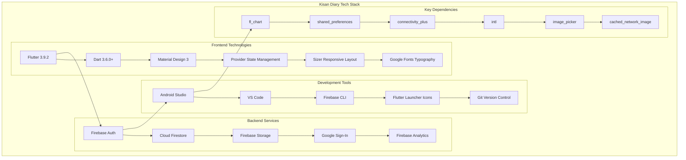
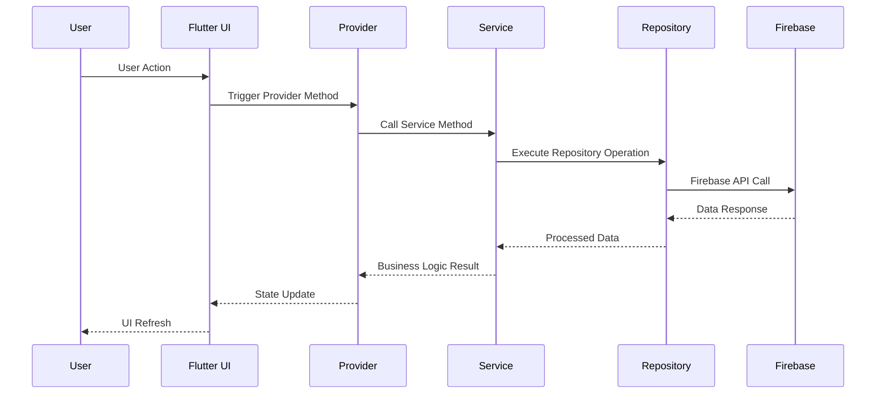
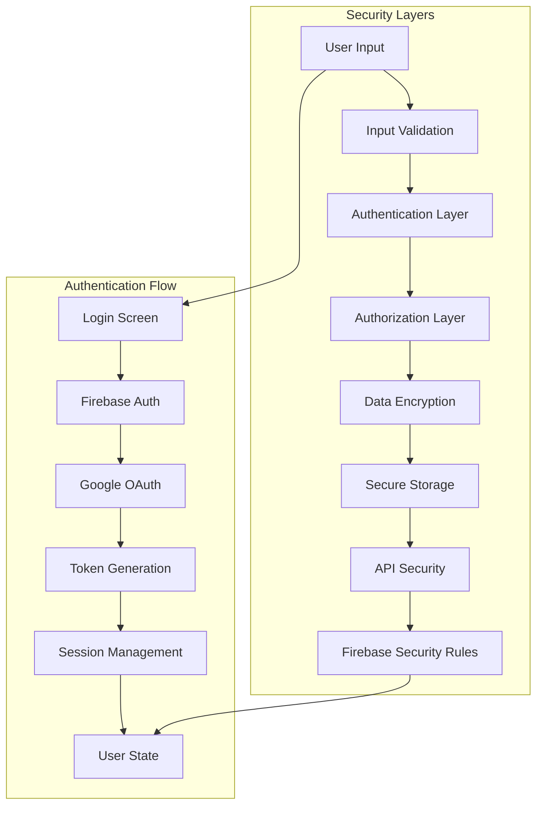
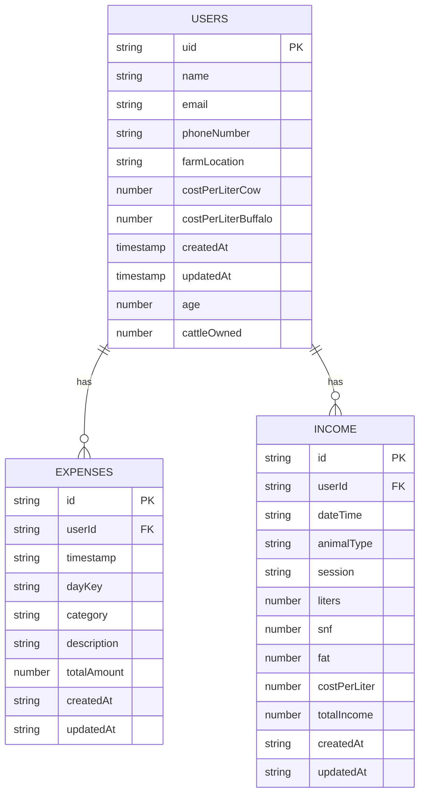
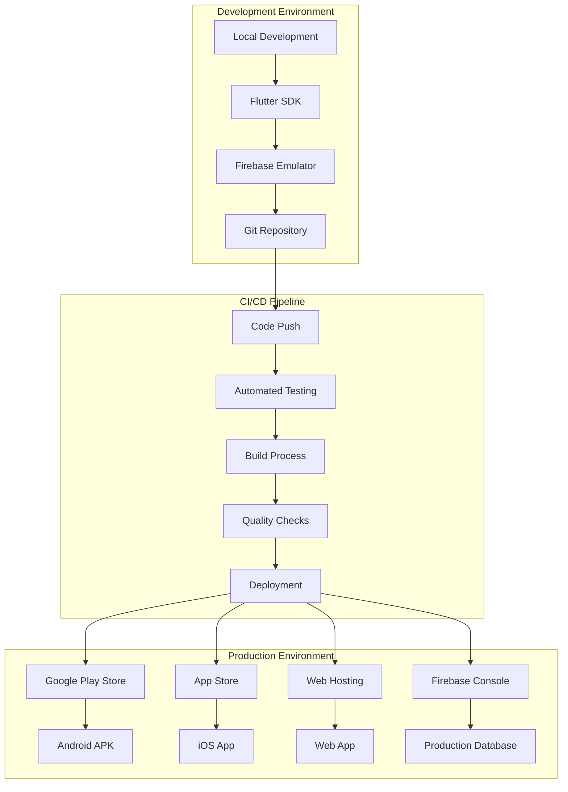
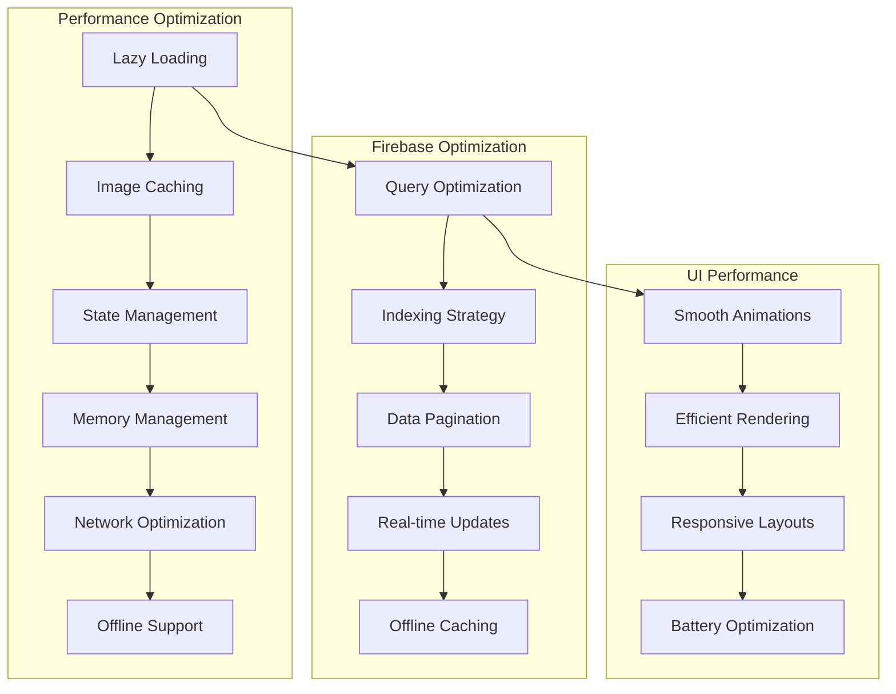

# Kisan Diary - Architecture Diagram

## System Architecture Overview

## Detailed Component Architecture

## Technology Stack Architecture

## Data Flow Architecture

## Security Architecture

## Database Schema Architecture

## Deployment Architecture

## Performance Architecture

This architecture diagram provides a comprehensive view of the Kisan Diary application's structure, showing how different components interact and how data flows through the system. The modular design ensures scalability, maintainability, and ease of development.
