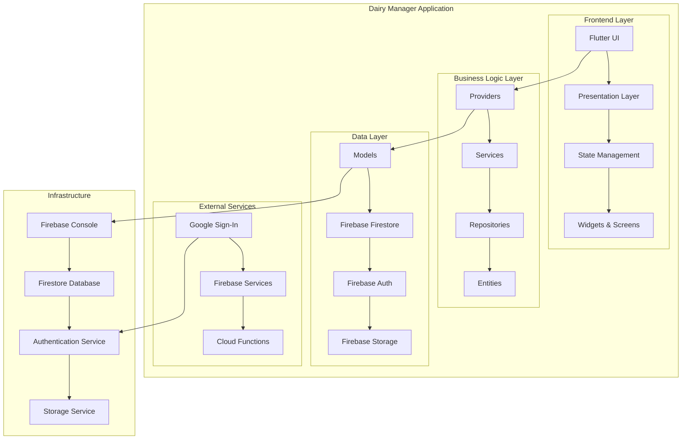

# Dairy Manager - Technical Documentation

## Table of Contents
1. [Project Overview](#project-overview)
2. [Architecture Diagram](#architecture-diagram)
3. [Technology Stack](#technology-stack)
4. [Project Structure](#project-structure)
5. [Core Components](#core-components)
6. [Data Models](#data-models)
7. [Backend Services](#backend-services)
8. [State Management](#state-management)
9. [UI/UX Design](#uiux-design)
10. [Authentication & Security](#authentication--security)
11. [Database Schema](#database-schema)
12. [API Integration](#api-integration)
13. [Localization](#localization)
14. [Deployment](#deployment)
15. [Development Guidelines](#development-guidelines)
16. [Testing Strategy](#testing-strategy)
17. [Performance Considerations](#performance-considerations)
18. [Troubleshooting](#troubleshooting)

---

## Project Overview

**Dairy Manager** is a comprehensive Flutter-based mobile application designed for dairy farm management. It provides farmers with tools to track milk production, manage expenses, generate reports, and streamline daily operations through a modern, responsive interface.

### Key Features
- **Milk Entry & Tracking**: Daily milk yield logging for cows and buffaloes with fat and SNF values
- **Expense Management**: Categorized expense tracking and management
- **Comprehensive Reports**: Interactive charts and analytics for production, revenue, and profit
- **User Authentication**: Secure sign-in with Google and email/password via Firebase Auth
- **Multi-language Support**: English and Telugu localization
- **Responsive UI**: Optimized for phones and tablets with smooth animations
- **Offline Support**: Core features work without internet connection

---

## Architecture Diagram



---

## Technology Stack

### Frontend Technologies
- **Flutter 3.9.2**: Cross-platform mobile framework
- **Dart 3.6.0+**: Programming language
- **Material Design 3**: UI component library
- **Provider**: State management solution
- **Sizer**: Responsive layout management

### Backend & Services
- **Firebase Auth**: User authentication and authorization
- **Cloud Firestore**: NoSQL document database
- **Firebase Storage**: File storage service
- **Google Sign-In**: OAuth authentication
- **Firebase Analytics**: User behavior tracking

### Development Tools
- **Android Studio**: Primary IDE
- **VS Code**: Alternative IDE with Flutter extensions
- **Firebase CLI**: Firebase project management
- **Flutter Launcher Icons**: App icon generation

### Key Dependencies
```yaml
dependencies:
  flutter: sdk: flutter
  provider: ^6.1.1
  firebase_core: ^4.1.1
  firebase_auth: ^6.1.0
  cloud_firestore: ^6.0.2
  firebase_storage: ^13.0.2
  google_sign_in: ^6.3.0
  fl_chart: ^1.1.1
  sizer: ^3.1.3
  google_fonts: ^6.1.0
  shared_preferences: ^2.2.2
  connectivity_plus: ^7.0.0
  intl: ^0.20.2
```

---

## Project Structure

```
dairy_manager/
├── android/                 # Android platform configuration
├── ios/                     # iOS platform configuration
├── lib/
│   ├── backend/            # Business logic layer
│   │   ├── entities/       # Domain entities
│   │   ├── repositories/   # Data access layer
│   │   └── services/       # Business services
│   ├── constants/          # App-wide constants
│   ├── core/               # Core utilities and exports
│   ├── l10n/               # Localization files
│   ├── models/             # Data transfer objects
│   ├── presentation/       # UI layer
│   │   ├── dashboard_screen/
│   │   ├── expenses_screen/
│   │   ├── login_screen/
│   │   ├── milk_entry_screen/
│   │   ├── reports_screen/
│   │   └── settings_screen/
│   ├── providers/          # State management
│   ├── routes/             # Navigation configuration
│   ├── theme/              # App theming
│   ├── utils/              # Utility functions
│   ├── widgets/            # Reusable UI components
│   └── main.dart           # Application entry point
├── assets/
│   └── images/             # Static assets
├── pubspec.yaml            # Dependencies and configuration
└── firebase.json           # Firebase configuration
```

---

## Core Components

### 1. Application Entry Point (`main.dart`)
- Initializes Firebase services
- Sets up error handling
- Configures app orientation
- Registers providers and routes

### 2. Navigation System (`routes/app_routes.dart`)
- Centralized route management
- Authentication wrapper
- Screen-specific provider injection
- Deep linking support

### 3. Theme System (`theme/app_theme.dart`)
- Material Design 3 implementation
- Custom color palette
- Typography configuration
- Component theming

---

## Data Models

### User Model
```dart
class UserModel {
  final String uid;
  final String name;
  final String email;
  final String phoneNumber;
  final String farmLocation;
  final double costPerLiterCow;
  final double costPerLiterBuffalo;
  final DateTime createdAt;
  final DateTime updatedAt;
  final int age;
  final int cattleOwned;
}
```

### Expense Model
```dart
class ExpenseModel {
  final String id;
  final DateTime dateTime;
  final ExpenseCategory category;
  final String description;
  final double amount;
}
```

### Income Model
```dart
class IncomeModel {
  final String id;
  final DateTime dateTime;
  final AnimalType animalType;
  final SessionType session;
  final double liters;
  final double snf;
  final double fat;
  final double costPerLiter;
  final double totalIncome;
  final DateTime createdAt;
  final DateTime updatedAt;
}
```

### Enums and Constants
```dart
enum AnimalType { cow, buffalo }
enum SessionType { morning, evening }
enum ExpenseCategory { feed, labour, healthcare, utilities, equipment, other }
enum GroupByFrequency { year, quarter, month, week, day }
```

---

## Backend Services

### Repository Pattern
The application follows the Repository pattern for data access:

#### Expense Repository
- CRUD operations for expense data
- Firestore integration
- Query optimization
- Data validation

#### User Repository
- User profile management
- Cost-per-liter configuration
- User document upsert operations

### Service Layer
Business logic is encapsulated in service classes:

#### Expense Service
- Expense validation
- Business rule enforcement
- Data transformation
- Error handling

#### Report Service
- Report generation
- Data aggregation
- Chart data preparation
- Analytics computation

---

## State Management

### Provider Pattern
The application uses Provider for state management:

#### Auth Provider
- User authentication state
- Login/logout operations
- Google Sign-In integration
- Session management

#### Expenses Provider
- Expense list management
- Category-wise calculations
- Loading states
- Error handling

#### Language Provider
- Multi-language support
- Locale switching
- Translation management

#### Navigation Provider
- Bottom navigation state
- Screen transitions
- Tab management

---

## UI/UX Design

### Design System
- **Primary Color**: #517186 (Blue)
- **Secondary Color**: #395364 (Dark Blue)
- **Accent Color**: #10B981 (Green)
- **Background**: #517186
- **Card Color**: #FFFFFF
- **Text Primary**: #1E293B
- **Text Secondary**: #64748B

### Typography
- **Font Family**: Inter (Google Fonts)
- **Headings**: 24-32px, FontWeight.w600
- **Body Text**: 14-16px, FontWeight.w400
- **Labels**: 12-14px, FontWeight.w500

### Component Library
- Custom buttons with elevation
- Glass morphism cards
- Animated transitions
- Responsive layouts
- Loading states

---

## Authentication & Security

### Firebase Authentication
- Email/password authentication
- Google OAuth integration
- Secure token management
- Session persistence

### Security Features
- Input validation
- Data sanitization
- Secure API calls
- Error handling

### User Roles
- **Farmer**: Full access to all features
- **Admin**: System administration (future enhancement)

---

## Database Schema

### Firestore Collections

#### Users Collection
```json
{
  "users": {
    "{userId}": {
      "uid": "string",
      "name": "string",
      "email": "string",
      "phoneNumber": "string",
      "farmLocation": "string",
      "costPerLiterCow": "number",
      "costPerLiterBuffalo": "number",
      "createdAt": "timestamp",
      "updatedAt": "timestamp",
      "age": "number",
      "cattleOwned": "number"
    }
  }
}
```

#### Expenses Subcollection
```json
{
  "users/{userId}/expenses": {
    "{expenseId}": {
      "timestamp": "string",
      "dayKey": "string",
      "category": "string",
      "description": "string",
      "totalAmount": "number",
      "createdAt": "string",
      "updatedAt": "string"
    }
  }
}
```

#### Income Subcollection
```json
{
  "users/{userId}/income": {
    "{incomeId}": {
      "dateTime": "string",
      "animalType": "string",
      "session": "string",
      "liters": "number",
      "snf": "number",
      "fat": "number",
      "costPerLiter": "number",
      "totalIncome": "number",
      "createdAt": "string",
      "updatedAt": "string"
    }
  }
}
```

---

## API Integration

### Firebase Services
- **Firestore**: Real-time database
- **Auth**: User authentication
- **Storage**: File uploads
- **Analytics**: User tracking

### External APIs
- **Google Sign-In**: OAuth authentication
- **Firebase Cloud Functions**: Serverless backend (future)

---

## Localization

### Supported Languages
- **English**: Primary language
- **Telugu**: Regional language support

### Implementation
- Flutter's built-in localization
- JSON-based translation files
- Dynamic language switching
- RTL support ready

### Translation Files
```
lib/l10n/
├── app_localizations.dart
├── app_localizations_en.dart
└── app_localizations_te.dart
```

---

## Deployment

### Android Deployment
```bash
flutter build apk --release
flutter build appbundle --release
```

### iOS Deployment
```bash
flutter build ios --release
```

### Web Deployment
```bash
flutter build web
```

### Firebase Configuration
- Project ID: `agile6th`
- Android App ID: `1:526058541371:android:fbad161b3bbb2349b5671e`
- Web App ID: `1:526058541371:web:9135290cdbc43c82b5671e`

---

## Development Guidelines

### Code Organization
- Follow Clean Architecture principles
- Separate concerns (UI, Business Logic, Data)
- Use meaningful naming conventions
- Implement proper error handling

### Git Workflow
- Feature branches for new development
- Pull requests for code review
- Commit messages following conventional format
- Regular integration with main branch

### Code Quality
- Follow Dart/Flutter style guide
- Use `flutter analyze` for code analysis
- Implement unit tests for business logic
- Write integration tests for critical flows

---

## Testing Strategy

### Unit Testing
- Model validation tests
- Service layer tests
- Utility function tests
- Provider state tests

### Widget Testing
- Screen component tests
- User interaction tests
- Navigation flow tests
- Form validation tests

### Integration Testing
- End-to-end user flows
- Firebase integration tests
- Authentication flow tests
- Data persistence tests

---

## Performance Considerations

### Optimization Techniques
- Lazy loading for large lists
- Image caching and optimization
- Efficient state management
- Memory leak prevention

### Firebase Optimization
- Efficient Firestore queries
- Proper indexing
- Data pagination
- Offline caching

### UI Performance
- Smooth animations
- Efficient rendering
- Responsive layouts
- Battery optimization

---

## Troubleshooting

### Common Issues

#### Firebase Connection Issues
- Verify `google-services.json` configuration
- Check Firebase project settings
- Ensure proper SHA-1 fingerprint

#### Authentication Problems
- Verify OAuth client configuration
- Check package name consistency
- Validate API keys

#### Build Issues
- Clean and rebuild project
- Update dependencies
- Check Flutter version compatibility

#### Data Sync Issues
- Verify Firestore rules
- Check network connectivity
- Validate data format

### Debug Tools
- Flutter Inspector
- Firebase Console
- Chrome DevTools
- Android Studio Profiler

---

## Future Enhancements

### Planned Features
- **Community Forum**: Farmer collaboration platform
- **Push Notifications**: Real-time updates
- **Offline Sync**: Enhanced offline capabilities
- **Advanced Analytics**: Machine learning insights
- **Multi-farm Support**: Multiple farm management
- **Export Functionality**: Data export options

### Technical Improvements
- **Microservices Architecture**: Scalable backend
- **Caching Layer**: Improved performance
- **API Rate Limiting**: Better resource management
- **Advanced Security**: Enhanced data protection

---

## Conclusion

Dairy Manager represents a modern, scalable solution for dairy farm management. Built with Flutter and Firebase, it provides a robust foundation for agricultural technology solutions. The clean architecture, comprehensive state management, and user-friendly interface make it an excellent choice for dairy farmers seeking digital transformation.

The application's modular design allows for easy maintenance and feature additions, while the Firebase backend ensures scalability and reliability. With proper testing and deployment practices, Dairy Manager can serve as a reliable tool for modern dairy farm operations.

---

*This documentation is maintained alongside the codebase and should be updated with any architectural changes or new features.*
